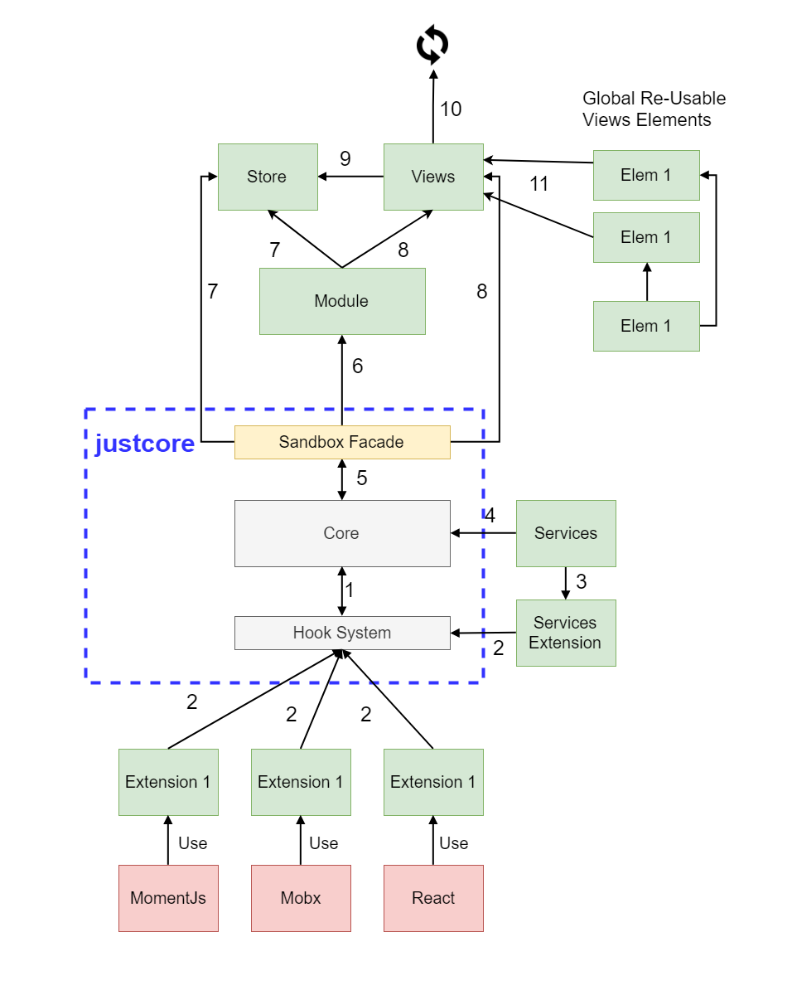

# Front-End Architectural Proposal

**TABLE OF CONTENT**

<ul>
  <li><a href="#technologies">Technologies</a></li>
  <li><a href="#diagram">Diagram</a></li>
  <li><a href="#concepts">Concepts</a></li>
  <li><a href="#folder">Folder</a></li>
</ul>

<h2 id="technologies"> Technologies </h2>

Definitive :

* **justcore** - This library is at the core of the architecture. More detailed explanation, by the author (and former coworker), can be found [here](https://github.com/valentin-lozev/justcore). Auto generated API reference [here](https://valentin-lozev.github.io/justcore/interfaces/core.__global.jc.core.html), we might want to update this document.

* **webpack** - this is the state of the art for JS bundlers, no real alternative here.

Optional, but preferred with the examples below :

* **typescript** - Typed languages are easier to maintain in the long run and we already use it a lot in the company.

* **react** - **justcore** allows us to use other lightweight libraries like Vue, or Polymer Web Components, for the view layer of the application, but for now, most people in the company are familiar with React, so it makes sense to choose it whenever we have the option to.

* **mobx** - This is the library of choice for state management, it's well known in the copmany, it's increadably simple and it's quite performant. It has functionalities out of the box, that can take weeks to implement in other libraries, like the ability to stop socket subscriptions on **"HTMLElement visibility change"**. Again **justcore** allows us to use other state management libraries like **redux**, if we <u>really</u> wanted to.

<h2 id="diagram"> Diagram </h2>



Diagram Legend:
1. The Hook System allows the user to create hooks before and after all major **Core** actions.
2. **Extensions** use the hook system to extend the **Core**.
3. **Services** are registered by the Service Extension.
4. **Services** have an instance of the **Core**, given to them by the Service Extension.
5. The **Sandbox** exposes selective **Core** functionalities.
6. The **Sandbox** starts **Modules**.
7. A **Module** initializes a **Store** and passes the **Sandbox** as its props.
8. A **Module** initializes a **View** and passes the **Store** and the **Sandbox** as its props.
9. A **View** uses a **Store** for state management.
10. **Views** can start new **Modules**, or smiply display some DOM elements.
11. **Views** can reuse globaly defined elemnts, which are in no way related to the system, they don't even have a **Sandbox** instance by default.

<h2 id="concepts"> Concepts </h2>

The main goal is to separate one big application into smaller manageable standalone **Modules**, which are isolated from one another and agnostic to the technologies used for state management, rendering, server client communication etc.

*note*: the design is created for Web applications only, at least for now.

### Core

The kernel of **justcore** provides us with 3 simple functionalities :

* The **Core** manages the **Modules**. In other words it starts, stops and keeps track of them.

* The **Core** has an **Extension Hook System** pipeline. This is the most important functionality, it allows us to create a library of extensions with any existing and future technologies adapted for our needs. We don't need to change the entire architecture, just so we can use a new library like GraphQL, Web Components etc.

* The **Core** provides inter-module communication mechanisms via a standard observer pattern, implemented in the **Module** itself. This functionality is implemented as an extension, in the future it might also be subject to customization.

### Sandbox

The **Sandbox** is an interface that connects the **Modules** to the outside world. **Modules** only know about their **Sandbox** instance and the rest of the architecture doesn't exist to them. Each **Sandbox** instance acts like a facade of the **Core** - translates its **Module's** requests into **Core** actions.

The **Sandbox** interface is the glue between **Modules** and provides us with the following benefits :

* Decouples different parts of the application.
* By using the **Extension Hook System** we can write adapters for any technology we like, the library has almost no opinion on the technologies that are used.
* Testing business logic is increadably simple, since all external functionality comes from the **Sandbox** and the **Sandbox** is a simple object, we just mock it with the needed mock functionality and that's it.
* Almost no need for global/static functionality, that can be hard to test and maintain.

*note:* It's important to take time to design the **Sandbox** API in the beggining, because all the rest of the application will depend on it. Using external libraries through adapters is an adviced practice, so they can be changed in the future.

### Modules

**Modules** consist of data and a **single** root view, and since they are decoupled from each other, you can make different architecture decisions per each one.

The closest thing as a concept to a **Module** is a Widget. Technically we can build a library of useful widgets and combined them to create SPA applications quickly. Those can be - text editors, admin panels, dashboards, custom calendars, or even full applications build in the past.

If we load **Modules asynchronously** webpack bundles them separately with their dependencies and improves initial load performance dramatically. Also allows for much better caching, which allows us to use Service Workers for Progressive web apps and offline use.

The above paragraphs stand true as long as some simple rules are followed :

<hr />

To start off - **All external dependencies for a Module are recevied through the **Sandbox** object !**

The main jobs of a **Module** are :

* Initializing a **View** element, a React Component for example.
* Initializing the props for that **View**, that could be a mobx store object, or a redux store object.
* Mounting that **View** someware in the DOM, often in some div. Might be done asynchronously, with react lazy loading for example.
* Publishing and receiving messages from other **Modules**. This is the only way to break the isolation from one **Module** to another.

Some rules that modules should follow:

* A **Module** should call its own methods or those on the sandbox
* A **Module** should not access DOM elements outside of its root
* A **Module** should not access non-native global objects
* A **Module** should ask its sandbox for anything else that is external to it
* A **Module** should not create global objects
* A **Module** should not directly reference other modules

### Extensions

Extensions are pieces of code that can extend the core in some of the following ways:

* An extension may add new functionality to the core that modules can use

* An extension may handle side effects by plugging into some of the application lifecycle hooks

* An extension may act as an adapter between your modules and 3rd party library. Such decoupling enables you to swap base libraries without changing the modules. This is something trivial and yet many developers reference 3rd party code directly!

* Combination of the options above. For instance you might create a React adapter that provides mountView() method to the modules, plugs into modules' destroy method and unmounts the view. As a result, React's usage will be abstracted and developers will not worry about unmounting given view when its module is destroyed.

### Extension Hook System

The hook system comes with a list of predefined hooks, but also allows the user to create custom hooks.

Defaults:

* `onCoreInit` - Invoked on `Core.init`. This is a hook on application startup.
* `onMessagePublish` - Invoked when `Core.publishAsync`. This is a hook on any message publishing.
* `onMessageSubscribe` - Invoked when `Core.onMessage`. This is a hook on any message subscription.
* `onModuleAdd` - Invoked when `Core.addModule`. This is a hook on adding **Modules** to the **Core**.
* `onModuleDestroy` - `Module.destroy`. This is a hook for clean up after a **Module** has been destroyed.
* `onModuleInit` - `Module.init`. This is a hook for any time a new **Module** is being initialized.
* `onModuleReceiveMessage` - `Module.moduleDidReceiveMessage`. This is a hook for receiving a message in a **Module**.
* `onModuleReceiveProps` - `Module.moduleDidReceiveProps`. This is a hook on receiving new props in a **Modules**.
* `onModuleStart` - `Core.startModule`. This is quite similar to `onModuleInit`, but it happens on start.
* `onModuleStop` - `Core.stopModule`. This is quite similar to `onModuleDestroy`, but it happens on stop.
* `onModuleSubscribe` - Invoked when `Module.moduleWillSubscribe`. This is a hook when **Module** subscribes to messages.

### Views

* **Views** are the most dynamic part of the application, often there is no time to test them, so we want to move any business logic out of the them and in some **Store** class.

* The only dependency they have are the **Store** and the **Sandbox**.

* **Views** are three types -
  * **Module** root **Views**
  * **Module** specific elements
  * Global reusable elements

### Services

* **Services** are adapeters for external libraries, or any other user defined specific functionality. Things like logging, sending HTTP requests, receiving data from WebSockets, DateTime manipulation etc. Any logic that is completely independent of the current application and can be re-used and tested in isolation.

* **Services** have a single instance.

* **Services** should be mainly used in **Stores**, but they can also be used on **Core** init logic and in **Extensions**.

* **Services** should not maintain state, that is the task of a **Store** !

* **Services** should not be used in **Views** directly.

### Stores

* **Stores** are the state management components for the system.

* **Stores** have a single instance per **Module**.

* **Stores** use services for common functionalities.

* **Stores** do not import or use other **Stores**.

* **Stores** are used, but are not aware of **Views**. Exceptions are commonly used elements, or a state based dynamic DOM element generation logic.

<h2 id="folder">Folder Structure</h2>

The application folder structure summary :

```js
/
  dist/    // production build folder
  src/
    config/    // folder for init app configurations
      modules-config.ts
      service-config.ts
    extensions/    // extension for the core
      react-adapter.ts
      mox-adapter.ts
    elements/    // folder for elements used globally
      grid/
        Grid.tsx
        Cell.tsx
        Row.tsx
      GlobalElem.tsx
    features/    // folder for all features
      home-feature/    // single feature folder
        elements/      // elements specific for the home feature
          HomeElement.tsx
        HomeProps.ts    // defines the Props for the View
        HomeStore.ts    // might use the AjaxService to fetch data
        HomeModule.ts    // mounts the View and inits the Store
        HomeView.tsx    // uses the store state to display data
    services/    // folder for services
      AjaxService.ts
      EnvService.ts
    styles/    // global styles for the app
    global.d.ts    // global typescript definitions
    app.ts    // app main
  index.html
```
